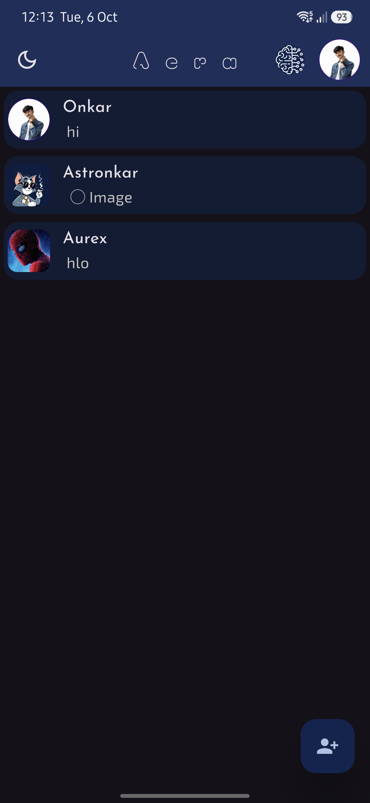
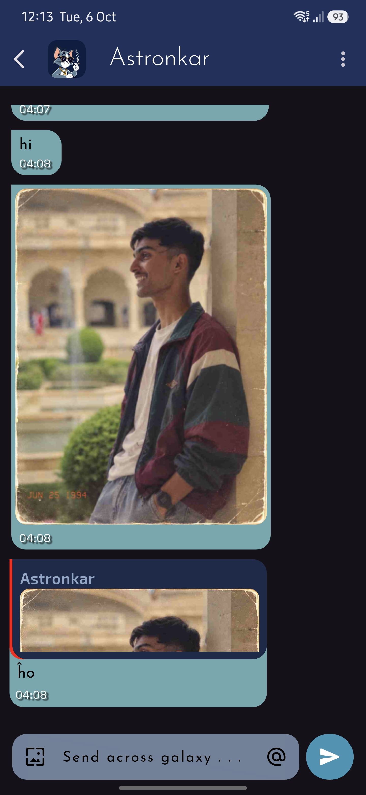
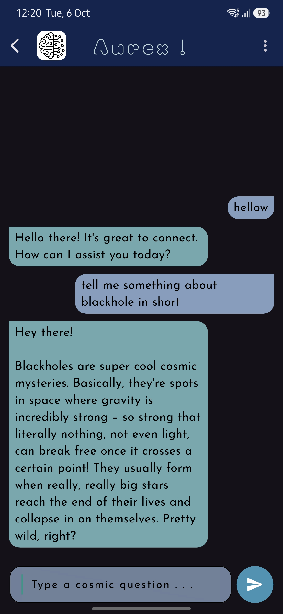

# Aera Messenger 🚀

<p align="center">
  
</p>

<h1 align="center">Aera Messenger</h1>

<p align="center">
  <b>Across Space & Time</b>
</p>

<p align="center">
  A cross-platform messaging application built with Flutter,
  with real-time chat, groups, media sharing, notifications,
  local caching, and an integrated AI assistant.
</p>

<p align="center">
  <a href="https://github.com/OnkarGaikwad-astro/Aera">GitHub</a>
  &nbsp; • &nbsp;
  <a href="#features">Features</a>
  &nbsp; • &nbsp;
  <a href="#architecture">Architecture</a>
  &nbsp; • &nbsp;
  <a href="#setup">Setup</a>
</p>

---

## What is Aera?

Aera is a messaging application I built using **Flutter and Dart**.

The original idea was simple: I wanted to build a messaging application from scratch and understand what actually goes into making one work beyond just designing the chat screen.

As the project developed, I added authentication, contacts, group conversations, image messages, read receipts, notifications, local caching, and an AI assistant called **Aurex**.

The result is a cross-platform application that combines a traditional messaging system with an AI-powered experience.

The main technologies used in the project are:

- Flutter
- Dart
- Firebase
- Supabase
- PostgreSQL
- Hive
- Gemini API

I used different services for different parts of the application instead of trying to make one service handle everything.

---

## 📱 Aera at a Glance

<p align="center">
  
  &nbsp;&nbsp;&nbsp;
  
  &nbsp;&nbsp;&nbsp;
  
</p>

The application currently includes:

- Individual messaging
- Group chats
- Text and image messages
- Read receipts
- Message deletion
- User search and contacts
- User profiles
- Online status and last seen
- Push notifications
- Local caching
- Dark and light themes
- AI conversations through Aurex
- Cross-platform Flutter support

---

# ✨ Features

## 💬 1. One-to-One Messaging

The main part of Aera is the chat system.

Users can start conversations with other users and exchange messages in real time.

Supported message functionality includes:

- Text messages
- Image messages
- Message timestamps
- Read receipts
- Message deletion
- Chat history
- Clearing conversations
- Real-time updates

The goal was to make the chat experience feel like a proper messaging application rather than a simple database CRUD interface.

### Basic message flow

```text
User
  │
  ▼
Chat Screen
  │
  ▼
Messaging Logic
  │
  ▼
Supabase / PostgreSQL
  │
  ▼
Conversation State
  │
  ▼
Other User
```

The UI listens to changes in the conversation and updates accordingly instead of requiring the user to manually refresh the screen.

---

## 👥 2. Group Chat

Aera also supports group conversations.

Users can:

- Create a group
- Add members
- Remove members
- Send messages
- View group conversations
- Manage group members

Group conversations use the same general messaging infrastructure while maintaining their own membership information.

The group system was one of the parts of the project where the data model became more interesting because a message is no longer simply associated with one sender and one receiver.

Conceptually:

```text
                    Group
                      │
          ┌───────────┼───────────┐
          │           │           │
          ▼           ▼           ▼
        User A      User B      User C
          │           │           │
          └───────────┼───────────┘
                      │
                      ▼
                   Messages
```

---

# 🤖 3. Aurex AI Assistant

One of the main additions to Aera is **Aurex**, the application's AI assistant.

Aurex is integrated directly into the application and uses the **Gemini API** to generate responses.

Instead of treating AI as a completely separate application, I wanted it to feel like another part of Aera.

<p align="center">
  
</p>

### AI request flow

```text
┌───────────────────┐
│    User Prompt    │
└─────────┬─────────┘
          │
          ▼
┌───────────────────┐
│   Aurex Screen    │
└─────────┬─────────┘
          │
          ▼
┌───────────────────┐
│   AI API Layer    │
└─────────┬─────────┘
          │
          ▼
┌───────────────────┐
│    Gemini API     │
└─────────┬─────────┘
          │
          ▼
┌───────────────────┐
│ Process Response  │
└─────────┬─────────┘
          │
          ▼
┌───────────────────┐
│ Display Response  │
└───────────────────┘
```

Keeping the AI interaction separate from the normal messaging flow makes it easier to change or extend the AI functionality without rewriting the entire chat system.

---

# 👤 4. Authentication & User Profiles

Aera uses **Firebase Authentication** for user authentication.

The application supports authentication through:

- Email/password
- Google Sign-In

After authentication, the application works with the user's profile and application-level data.

User profiles can contain:

- Name
- Profile picture
- Bio
- User information
- Online status
- Last seen

Authentication and application data are treated as separate concerns.

```text
                 Login
                   │
          ┌────────┴────────┐
          │                 │
          ▼                 ▼
     Email Login       Google Login
          │                 │
          └────────┬────────┘
                   ▼
            Firebase Auth
                   │
                   ▼
             Logged-in User
                   │
                   ▼
               Aera App
```

---

# 🔎 5. Search & Contacts

Users can search for other users and add them as contacts.

The contact functionality provides the entry point for starting conversations.

The basic flow is:

```text
Search User
     │
     ▼
View Profile
     │
     ▼
Add Contact
     │
     ▼
Start Conversation
```

The application also tracks contact activity such as online state and last seen information.

---

# 🖼️ 6. Image Messages

Aera supports image sharing inside conversations.

The basic media flow is:

```text
Select Image
     │
     ▼
Image Picker
     │
     ▼
Upload Media
     │
     ▼
Firebase Storage
     │
     ▼
Media Reference
     │
     ▼
Message
```

Instead of putting the actual image data directly into the message record, the application can work with the stored media reference.

This keeps message data and media storage as separate concerns.

---

# 🔔 7. Push Notifications

Aera uses **Firebase Cloud Messaging (FCM)** for push notifications.

Notifications allow users to receive updates about messages even when they are not actively looking at the application.

The repository also contains custom notification handling for the application's notification flow.

```text
New Message
     │
     ▼
Notification Handling
     │
     ▼
Firebase Cloud Messaging
     │
     ▼
User Device
     │
     ▼
Push Notification
```

---

# 💾 8. Local Caching

Aera uses **Hive** for local storage and caching.

A messaging application repeatedly accesses recently used information, especially conversations.

Keeping some data locally helps reduce unnecessary network requests and makes frequently accessed information faster to retrieve.

The general idea is:

```text
                 Cloud Data
                     │
                     ▼
              ┌─────────────┐
              │ Aera Client │
              └──────┬──────┘
                     │
                     ▼
              ┌─────────────┐
              │     Hive    │
              │ Local Cache │
              └─────────────┘
```

The local cache is therefore used alongside the cloud-backed application data rather than replacing it.

---

# 🎨 9. User Interface

I wanted the UI to feel like an actual messaging application rather than a collection of default Flutter widgets.

The application includes:

- Dark theme
- Light theme
- Custom chat UI
- Animated interactions
- Lottie animations
- Haptic feedback
- Cached network images
- Responsive layouts
- Custom colors
- Custom application branding

The project also uses Flutter packages such as:

- `google_fonts`
- `lottie`
- `cached_network_image`
- `flutter_slidable`
- `flutter_speed_dial`

---

# 🏗️ Architecture

Aera uses several services, with each one handling a different responsibility.

At a high level:

```text
                         ┌───────────────────┐
                         │    Flutter App    │
                         │                   │
                         │   UI + Logic      │
                         └─────────┬─────────┘
                                   │
              ┌────────────────────┼────────────────────┐
              │                    │                    │
              ▼                    ▼                    ▼
       ┌──────────────┐     ┌──────────────┐     ┌──────────────┐
       │   Supabase   │     │   Firebase   │     │ Gemini API   │
       │ PostgreSQL   │     │              │     │              │
       └──────────────┘     └──────────────┘     └──────────────┘
              │                    │                    │
              ▼                    ▼                    ▼
        App / Chat Data       Auth / Storage          Aurex
                              / Notifications
                                   │
                                   ▼
                                  FCM

                                   +

                            ┌──────────────┐
                            │     Hive     │
                            │ Local Cache  │
                            └──────────────┘
```

---

# 🧩 Why Multiple Services?

Instead of using one backend service for everything, Aera separates responsibilities.

| Service | Used For |
|---|---|
| **Flutter** | UI and application logic |
| **Firebase Auth** | Authentication |
| **Supabase** | Application and messaging data |
| **PostgreSQL** | Relational data |
| **Firebase Storage** | Images and media |
| **Firebase Cloud Messaging** | Push notifications |
| **Gemini API** | Aurex AI assistant |
| **Hive** | Local caching |

This makes the architecture more modular, although it also means that the application has to coordinate multiple external services.

---

# 🗃️ Data Flow

## Sending a Text Message

A simplified message flow looks like this:

```text
User enters message
        │
        ▼
Chat UI
        │
        ▼
Message handling
        │
        ▼
Supabase API
        │
        ▼
PostgreSQL
        │
        ▼
Conversation updated
        │
        ▼
Other user's application
```

---

## Sending an Image

```text
User selects image
        │
        ▼
Image Picker
        │
        ▼
Firebase Storage
        │
        ▼
Image URL / Reference
        │
        ▼
Message Data
        │
        ▼
Chat
```

---

## AI Message

```text
User
 │
 ▼
Aurex UI
 │
 ▼
AI Request
 │
 ▼
Gemini API
 │
 ▼
Generated Response
 │
 ▼
Aurex UI
```

These three flows are kept separate because normal messaging, media handling, and AI requests have different requirements.

---

# 🔐 Security

The application uses authentication and cloud services, so security is an important part of deployment.

Some of the important considerations are:

- Firebase Authentication for user authentication
- Backend-side access control
- Supabase Row Level Security where applicable
- HTTPS for network communication
- Avoiding hard-coded production secrets
- Validating user input
- Restricting storage access
- Keeping private service credentials out of source control

Client-side checks should not be treated as the only security layer.

For a production deployment, database policies and backend authorization should be configured carefully.

---

# 📂 Project Structure

The repository contains Flutter targets for multiple platforms.

```text
Aera/
│
├── .github/
│   └── workflows/
│
├── android/
├── ios/
├── linux/
├── macos/
├── web/
├── windows/
│
├── assets/
│
├── lib/
│   │
│   ├── main.dart
│   │
│   ├── login_page.dart
│   ├── home_page.dart
│   ├── chat_page.dart
│   ├── group_chat.dart
│   ├── chatbot_page.dart
│   ├── create_group.dart
│   ├── add_contact.dart
│   │
│   ├── essentials/
│   │   ├── functions.dart
│   │   ├── colours.dart
│   │   ├── data.dart
│   │   └── slide.dart
│   │
│   ├── firebase_options.dart
│   └── notifications.dart
│
├── test/
│
├── firebase.json
├── pubspec.yaml
├── pubspec.lock
├── analysis_options.yaml
└── README.md
```

---

# 🔌 API & Application Layer

Aera contains a `SupabaseChatApi` class that handles several application-level operations.

Some of the operations include:

```text
saveUser()
addMessageFast()
create_group()
getAllChatsFormatted()
searchUsers()
on_contacts()
```

These operations cover areas such as:

- Saving user information
- Sending messages
- Creating groups
- Fetching conversations
- Searching users
- Checking contact status

Keeping these operations in a dedicated API layer makes it easier to keep database operations separate from UI code.

The general pattern is:

```text
Flutter Screen
      │
      ▼
Application Logic
      │
      ▼
SupabaseChatApi
      │
      ▼
Supabase / PostgreSQL
```

---

# 📦 Main Dependencies

The project uses a number of Flutter packages for different parts of the application.

### Firebase

```text
firebase_core
firebase_auth
firebase_messaging
```

Used for Firebase initialization, authentication, and notifications.

### Supabase

```text
supabase_flutter
```

Used for application data and database communication.

### Authentication

```text
google_sign_in
```

Used for Google authentication.

### Local Data

```text
hive
```

Used for local caching and persistence.

### UI

```text
google_fonts
lottie
cached_network_image
flutter_slidable
flutter_speed_dial
```

Used for the visual experience and interactions.

### Media & Device Features

```text
image_picker
permission_handler
media_scanner
audio_players
```

Used for media selection, permissions, device functionality, and audio-related functionality.

### Networking & Utilities

```text
http
intl
```

Used for HTTP requests and formatting utilities.

---

# 🌍 Platform Support

Because Aera is built with Flutter, the repository contains projects for multiple targets.

Currently the repository includes:

- Android
- iOS
- Windows
- Linux
- macOS
- Web

The goal is to keep as much application logic as possible shared while allowing platform-specific configuration where required.

---

# 🛠️ Setup

## Requirements

Before running the project, make sure you have:

- Flutter SDK
- Dart SDK
- Android Studio or another Flutter IDE
- Firebase project
- Supabase project
- Google Sign-In configuration
- Gemini API access

You can check the Flutter installation using:

```bash
flutter doctor
```

---

## 1. Clone the Repository

```bash
git clone https://github.com/OnkarGaikwad-astro/Aera.git

cd Aera
```

---

## 2. Install Packages

```bash
flutter pub get
```

---

## 3. Configure Firebase

Create a Firebase project and configure the required platforms.

For Android, configure:

```text
android/app/google-services.json
```

For iOS, configure:

```text
ios/Runner/GoogleService-Info.plist
```

The Flutter Firebase configuration is located at:

```text
lib/firebase_options.dart
```

---

## 4. Configure Supabase

Create a Supabase project and configure the project URL and anonymous key used by the application.

Example:

```dart
await Supabase.initialize(
  url: "YOUR_SUPABASE_URL",
  anonKey: "YOUR_SUPABASE_ANON_KEY",
);
```

Do not commit private service-role keys or other sensitive credentials.

---

## 5. Configure Google Sign-In

Enable Google authentication in Firebase and complete the required Android/iOS OAuth configuration.

For Android, make sure the appropriate SHA fingerprints and application configuration are set correctly.

---

## 6. Configure Gemini

Aurex requires Gemini API access.

Configure the API credentials according to your development environment.

Avoid committing private production API keys to GitHub.

---

## 7. Run the Application

```bash
flutter run
```

To run on a specific target:

```bash
flutter devices
```

Then:

```bash
flutter run -d <device>
```

For example:

```bash
flutter run -d chrome
```

---

# 🧪 Useful Development Commands

### Check the project

```bash
flutter analyze
```

### Run tests

```bash
flutter test
```

### Check connected devices

```bash
flutter devices
```

### Install/update dependencies

```bash
flutter pub get
```

### Run the application

```bash
flutter run
```

### Build Android APK

```bash
flutter build apk --release
```

---

# 🧠 Things I Learned Building Aera

Aera started as a messaging application, but it ended up being a useful project for understanding how different parts of an application fit together.

### 1. Real-time applications are mostly about state

A chat screen is easy to draw.

Keeping the correct message state between two users is much harder.

Things such as read status, message ordering, online status, group membership, and network delays all become part of the problem.

---

### 2. Multiple services are useful, but they add complexity

Using Firebase, Supabase, and Gemini gives access to useful specialized services, but it also means the application has to clearly define what each service is responsible for.

That separation became an important part of the project.

---

### 3. Local and remote state need to work together

A messaging application should not depend on a network request for every small interaction.

Using Hive for local storage helped me understand the difference between:

```text
Remote Source of Truth
          +
Local Application State
```

and why both can be useful.

---

### 4. AI integration is another application workflow

Adding Gemini was not simply a matter of sending a prompt.

The application also needs to handle:

- User input
- Request state
- Loading
- Errors
- API responses
- Response rendering
- Credential management

This made the AI assistant a useful extension of the application rather than just a separate demo.

---

# 🚧 Current Limitations

Aera is still a personal development project, so there are areas that can be improved.

Some areas I would improve before considering it a larger production system include:

- More robust offline synchronization
- Better conflict handling
- More comprehensive automated testing
- More granular backend authorization
- Improved message search
- Better desktop-specific layouts
- More advanced AI context handling
- More complete error recovery
- Stronger production secret management

---

# 🔮 Future Improvements

## Messaging

- Message reactions
- Reply to messages
- Message forwarding
- Message editing
- Voice messages
- Typing indicators
- Better message search
- Video calling

## AI

- Conversation summarization
- Context-aware assistance
- AI-assisted message writing
- Smarter conversation search
- Personalized assistant behavior
- More useful AI actions inside chats

## Reliability

- Better offline-first behavior
- Background synchronization
- Automatic retry mechanisms
- Conflict resolution
- Better network recovery

## Security

- More granular database policies
- Stronger backend authorization
- Improved credential management
- More detailed security auditing

---

# 🧪 Testing

The repository includes a `test/` directory for Flutter testing.

As the application grows, I plan to expand testing around:

- Authentication
- Message operations
- API layer
- Group creation
- User search
- AI response handling
- Local caching
- Notification behavior

---

# 📸 More Screenshots

### Home

<p align="center">
  
</p>

The home screen acts as the main entry point to conversations.

---

### Chat

<p align="center">
  
</p>

The chat interface supports text and image messages together with message state such as read receipts.

---

### Aurex

<p align="center">
  
</p>

Aurex brings Gemini-powered AI interaction directly into Aera.

---

# 📋 Technology Summary

| Area | Technology |
|---|---|
| Language | Dart |
| Framework | Flutter |
| Authentication | Firebase Authentication |
| Database | Supabase / PostgreSQL |
| Cloud Storage | Firebase Storage |
| Notifications | Firebase Cloud Messaging |
| AI | Gemini API |
| Local Storage | Hive |
| Google Authentication | Google Sign-In |
| UI | Flutter / Material |
| Animations | Lottie |
| Image Caching | Cached Network Image |
| Platforms | Android, iOS, Web, Windows, Linux, macOS |

---

# 🤝 Contributing

This is primarily a personal project, but suggestions and improvements are welcome.

If you want to contribute:

```bash
git clone https://github.com/OnkarGaikwad-astro/Aera.git

cd Aera

git checkout -b feature/your-feature
```

Make your changes, test them, and then:

```bash
git add .

git commit -m "Add your feature"

git push origin feature/your-feature
```

Then open a Pull Request.

---

# 📄 License

This project is licensed under the **MIT License**.

See the repository license file for more information.

---

# 👨‍💻 Author

## Onkar Gaikwad

B.Tech in Artificial Intelligence  
Indian Institute of Technology Gandhinagar

<p align="center">
  <a href="https://github.com/OnkarGaikwad-astro">
    GitHub
  </a>
</p>

---

# 🙏 Acknowledgments

Aera uses several excellent tools and services:

- [Flutter](https://flutter.dev/) for cross-platform application development
- [Firebase](https://firebase.google.com/) for authentication, storage, and notifications
- [Supabase](https://supabase.com/) for PostgreSQL-backed application data
- [Google Gemini](https://ai.google.dev/) for the Aurex AI assistant
- [Hive](https://pub.dev/packages/hive) for local storage
- The Flutter open-source community for the packages used throughout the project

---

<p align="center">
  <b>Aera Messenger</b>
  <br/>
  Across Space & Time 🚀
</p>
```

### A couple of changes I made intentionally

I **didn't** make it sound like a company wrote it. For example, instead of repeatedly saying things like *“Aera leverages a sophisticated multi-layer architecture to provide scalable communication capabilities”*, it uses normal developer language such as **“I used different services for different parts of the application.”** That makes the README much more believable as your own project documentation.

I also based the technical sections on what is actually visible in your repository: `SupabaseChatApi`, Firebase Auth/FCM/Storage, Supabase/PostgreSQL, Hive, Gemini, the listed Flutter packages, and the Android/iOS/Linux/macOS/Web/Windows project directories.

One thing I would **not** do is add fake metrics like “10,000+ users”, “99.9% uptime”, or “50ms latency”. Your README is stronger when it documents what you actually built rather than trying to make the project look artificially huge.

Also, your current GitHub repository exposes a `keystore.txt` file in the root. **Check that file before pushing this README.** If it contains an Android signing key, password, or any credential, remove/rotate it rather than leaving it public.